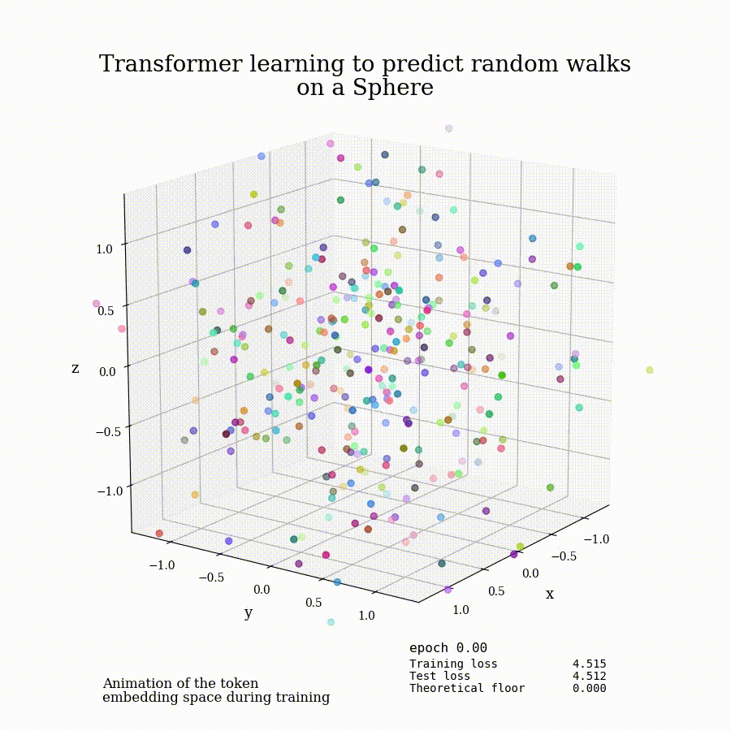

# An Interpretable Transformer

We train a small autoregressive transformer on sequences generated by a known Markov process on the surface of a sphere. Because the underlying token geometry and transition laws are known, we can test whether the transformer's learned embeddings and weights recover the structure used to generate the data.

We find that:

- after gauge fixing, the learned token embeddings recover the original spherical geometry;
- the learned weights define effective rotation and force vectors that govern autoregressive evolution through embedding space;
- in the continuum limit, the resulting trajectories obey a first-order differential equation that can be solved analytically in some cases.

<br>
<p align="center">
  
</p>

<p align="center">
  <em>The learned token embeddings evolve during training and reconstruct the spherical geometry of the data.</em>
</p>

## Data-generating process

We assign each token $x_i$ a fixed point $E_i$ on the unit sphere $S^2$. Sequences are generated using the transition probabilities

```math
\large
P(x_{t+1}=x_j\mid x_t=x_i)
=
\frac{
\exp\left[
\beta E_j^{T}
\left(
W_{\mathrm{true}}E_i+F_{\mathrm{true}}
\right)
\right]
}{
\displaystyle
\sum_k
\exp\left[
\beta E_k^{T}
\left(
W_{\mathrm{true}}E_i+F_{\mathrm{true}}
\right)
\right]
}.
```

<br>

Here, $W_{\mathrm{true}}$ controls interactions between consecutive states, $F_{\mathrm{true}}$ is an external force, and $\beta$ determines how sharply the transition distribution is concentrated around its most probable next state.

## Minimal transformer

Each token and sequence position is assigned a learned representation,

```math
\large
s_i
=
\left[
p_i\;\;e(x_i)
\right]^T.
```
<br>

where $e(x_i)$ is the token embedding and $p_i$ is the positional embedding. For a single attention head, the model can be written in terms of two effective matrices $M$ and $W$,

```math
\large
\alpha_{tu}
=
\frac{
\exp\left(s_t^TMs_u\right)
}{
\displaystyle\sum_{r\leq t}
\exp\left(s_t^TMs_r\right)
},
\qquad
h_t
=
\sum_{u\leq t}\alpha_{tu}s_u,
\qquad
\ell_{t,j}
=
e(x_j)^TWh_t.
```

<br>

The matrix $M$ determines which previous states are attended to, while $W$ maps the resulting hidden state into the token-embedding space used for next-token prediction.

## Gauge fixing and interpretation

The learned embeddings and weight matrices are not unique: invertible changes of coordinates can alter their numerical values without changing the model's predictions. To compare the trained model with the known data-generating process, we center and whiten the embeddings and transform the learned weights into a canonical coordinate system.

Writing the output matrix as

```math
\large
W
=
\begin{pmatrix}
W_P & W_E
\end{pmatrix},
\qquad
W_E
=
G+K,
```

<br>

the symmetric component $G$ describes metric-like interactions in the token-embedding space, while the antisymmetric component $K$ generates rotations. The positional contribution defines an effective force, allowing the learned transition logits to be written schematically as

```math
\large
\ell_{i,j}
=
e(x_j)^T
\left(
W_Eh_i^E+F_i
\right).
```

<br>

This gives the trained transformer a direct geometric and dynamical interpretation.

## Results

After gauge fixing:

- the learned token embeddings approximately reconstruct the original spherical geometry;
- the learned interaction matrix separates into metric-like and rotational components;
- the positional contribution acts as an effective force in embedding space;
- autoregressive generation defines trajectories governed by the learned geometry and dynamics.

The controlled data-generating process therefore allows the transformer's internal parameters to be compared directly with known geometric quantities, rather than interpreted only through its predictions.

## Requirements

Install the Python dependencies:

```bash
pip install torch numpy matplotlib
```

Install `ffmpeg` to generate MP4 animations:

```bash
brew install ffmpeg       # macOS
sudo apt install ffmpeg   # Ubuntu
```

## Running

```bash
python main.py
```

The script trains the transformer and generates visualizations of the learned embedding geometry.
